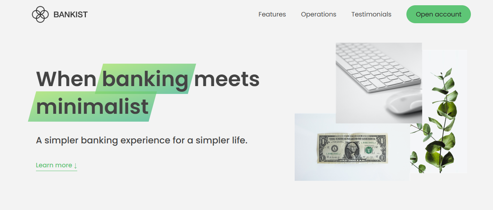

# Bankist App

A sleek, single-page banking app that brings modern UX patterns—like lazy loading, sliders, modals, and sticky nav—to life with clean vanilla JavaScript.



## 🚀 Live Demo

[Click here to try it out!](https://bankist-app-blue.vercel.app/)

## ✨ Features

- Smooth scrolling navigation
- Tabbed interface for operations
- Lazy loading images for performance
- Interactive slider with navigation controls
- Modal window for account creation
- Sticky navigation bar
- Fully responsive across devices

## 🛠️ Technologies Used

- HTML5
- CSS3 (with custom properties)
- JavaScript (ES6+)
- Intersection Observer API
- Event Delegation pattern

## 📂 Getting Started

1. Clone the repo:

```bash
git clone https://github.com/harisrox/bankist-app.git
```
